# rcat-voice

低延迟流式语音对话库：**Mic → ASR → Turn End → LLM → TTS → 播放**

## ✨ 特性

- 🎤 **流式 ASR** - Sherpa-ONNX (Paraformer/SenseVoice/FunASR)
- 🔚 **智能端点检测** - Smart Turn v3 ONNX
- 🗣️ **流式 TTS** - GPT-SoVITS (CUDA/ONNX) / OS TTS / Remote
- ⚡ **低延迟优化** - LLM Client 复用、模型预热、VAD Barge-in
- 📊 **可观测性** - 延迟指标、Ring Buffer 监控

---

## 流水线时序

> **实测 5070TI 音频生成延迟（TTS_TTFA）180-400ms**
>
> 实测 4060 移动端音频生成延迟（TTS_TTFA）450-800ms

下图展示了 **Serial Mode（默认）** 下各阶段的覆盖范围和并行度：

```mermaid
gantt
    title 流式 ASR → LLM → Orchestrator → TTS(Serial) → 播放（连续流）
    dateFormat x
    axisFormat %Lms

    section 用户输入
    用户说话               :user, 0, 2000
    静音 + 端点检测         :silence, 2000, 2500

    section ASR
    VAD 分段（含尾静音）     :vad, 0, 2100
    ASR 推理（分段整段）     :asr, 500, 2400

    section LLM
    TTFT 等待               :crit, ttft, 2500, 3000
    Token 流式输出           :llm, 3000, 5500

    section Orchestrator
    分句缓冲（Eager）        :tok, 3000, 3100
    Segment1 发出（事件）     :seg1, 3100, 3101
    Segment2 发出（事件）     :seg2, 4200, 4201
    Segment3 发出（事件）     :seg3, 5400, 5401

    section TTS（Serial Streaming）
    TTS Seg1 生成（持续产PCM）:tts1, 3100, 4300
    TTS Seg2 生成             :tts2, 4200, 5200
    TTS Seg3 生成             :tts3, 5400, 6200

    section 音频播放（同一条连续流）
    Prefill（首PCM后到开播）  :prefill, 3300, 3400
    连续播放（Seg1+Seg2+Seg3） :play, 3400, 6600
```



> **关键特征**: TTS 与播放重叠，Prefill 只发生一次，后续 Segment 追加进同一连续播放流。
> **瓶颈**: TTFT 等待（红色）是首轮延迟的主要来源。

## 快速开始：语音助手

```powershell
# 1. 必填环境变量
$env:OPENAI_API_KEY = "your-api-key"
$env:OPENAI_BASE_URL = "https://api.deepseek.com/v1"

# 2. 统一模型目录（推荐：只需这一个路径）
# 目录结构参考：rcat/models/README.md
$env:RCAT_MODELS_DIR = "F:\\github\\rcat\\models"

# 3. ASR 配置
$env:ASR_MODEL = "funasr-nano-int8"

# 4. TTS 后端 (选一)
$env:TTS_BACKEND = "os"              # 系统 TTS (最简单)
# $env:TTS_BACKEND = "gpt-sovits-onnx" # GPT-SoVITS CPU
# $env:TTS_BACKEND = "gpt-sovits"      # GPT-SoVITS CUDA (Windows only)

# 5. 运行
cargo run --example voice_assistant --features asr-sherpa,asr-mic,turn-smart --release
```

---

## 可选调优环境变量

- `STREAM_DELTA_CAPACITY`：LLM 输入队列容量（默认 8192）
- `STREAM_SEGMENT_CAPACITY`：文本分段 backlog 上限（默认 4096）
- `TTS_PIPELINE_MODE`：`auto | serial | decoupled`（调度模式）

## 关键性能指标

| 指标               | 全称                | 定义                            | 典型目标 |
| ------------------ | ------------------- | ------------------------------- | -------- |
| **LLM_TTFT** | Time To First Token | LLM 请求 → 首个非空 delta 到达 | < 500ms  |
| **TTS_TTFA** | 音频生成延迟        | 首段送入 TTS → 首音（可播）    | < 300ms  |
| **E2E_TTFA** | 端到端延迟          | 用户说完 → 首音（可播）        | < 800ms  |

---

## 📚 文档

| 文档                                       | 内容                               |
| ------------------------------------------ | ---------------------------------- |
| [ARCHITECTURE.md](docs/ARCHITECTURE.md)       | 数据流、Channel 拓扑、时间指标定义 |
| [FEATURE_MAP.md](docs/FEATURE_MAP.md)         | 功能-代码映射                      |
| [TROUBLESHOOTING.md](docs/TROUBLESHOOTING.md) | 故障排查                           |

---

## 🎙️ 说话人识别与分离

提供两个独立示例用于说话人相关功能：

### 模型下载

```bash
# 说话人 Embedding 模型 (3dspeaker, 推荐)
wget https://github.com/k2-fsa/sherpa-onnx/releases/download/speaker-recongition-models/3dspeaker_speech_eres2net_base_sv_zh-cn_3dspeaker_16k.onnx

# 分段模型 (pyannote segmentation, 用于 diarization)
wget https://github.com/k2-fsa/sherpa-onnx/releases/download/speaker-segmentation-models/sherpa-onnx-pyannote-segmentation-3-0.tar.bz2
tar xvf sherpa-onnx-pyannote-segmentation-3-0.tar.bz2
# 使用 model.int8.onnx 在 CPU 上更快
```

### Example 1: Speaker ID Gate (说话人验证)

适用于"只响应主人"场景，作为 ASR 前置 gate：

```bash
cargo run --example speaker_id_gate --features asr-sherpa -- \
    --model 3dspeaker_speech_eres2net_base_sv_zh-cn_3dspeaker_16k.onnx \
    --enroll owner1.wav --enroll owner2.wav \
    --test unknown.wav \
    --threshold 0.5
```

> **低延迟集成**: 在 VAD/turn-end 切出的 utterance 上运行一次 embedding（约10-50ms），与预存 voiceprint 对比，低于阈值则丢弃，不进入 ASR/LLM。

### Example 2: Diarize Offline (离线说话人分离)

输出"谁在什么时候说话"：

```bash
cargo run --example diarize_offline --features asr-sherpa -- \
    --seg-model sherpa-onnx-pyannote-segmentation-3-0/model.onnx \
    --emb-model 3dspeaker_speech_eres2net_base_sv_zh-cn_3dspeaker_16k.onnx \
    --audio meeting.wav \
    --json
```

> **在线近似**: 对于实时场景，建议使用 utterance-level speaker labeling：VAD → embedding → `EmbeddingManager.search()` 归类/更新 speaker 原型。

---

## Cargo Features

| Feature             | 功能                | 依赖           |
| ------------------- | ------------------- | -------------- |
| `gpt-sovits`      | GPT-SoVITS CUDA TTS | Windows + CUDA |
| `gpt-sovits-onnx` | GPT-SoVITS CPU TTS  | 跨平台         |
| `asr-sherpa`      | Sherpa-ONNX ASR     | -              |
| `asr-mic`         | 麦克风输入          | cpal           |
| `turn-smart`      | Smart Turn 端点检测 | ONNX           |
| `tts-remote`      | 远程 TTS            | HTTP           |
| `audio-rodio`     | Rodio 播放          | rodio          |

---

## 备注

- **GPT-SoVITS CUDA**: 当前仅在 Windows + CUDA 环境验证与支持
- **Tauri 兼容性**: libtorch + ONNX 同进程可能崩溃，推荐使用 `tts-remote` 或分进程
- 详见 [TROUBLESHOOTING.md](docs/TROUBLESHOOTING.md) 解决常见问题
