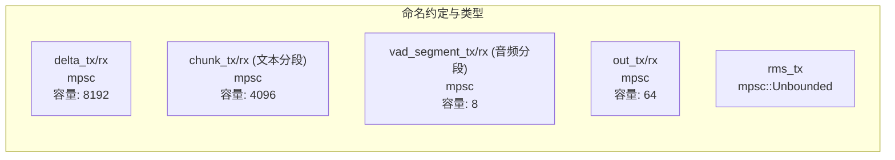
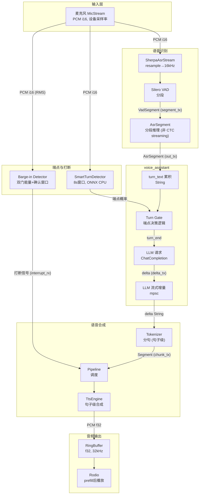

# rcat-voice 架构文档

## 项目概览

rcat-voice 是一个低延迟流式语音对话库，实现 **Mic → ASR → Turn End → LLM → TTS** 的端到端语音交互。

### 设计目标

1. **低延迟**: 最小化用户说完到听到回复的时间 (E2E_TTFA)
2. **流式处理**: 全链路流式，不等待完整结果
3. **可扩展**: 通过 Trait 抽象支持多种后端
4. **易集成**: 通过环境变量配置，无需重新编译

### 设计原则

- **异步优先**: 使用 Tokio 异步运行时
- **特性驱动**: 通过 Cargo features 按需编译
- **解耦合**: 模块通过 Channel 通信

---

## 核心接口与数据类型

### Trait 定义

#### TtsEngine (语音合成引擎)

```rust
pub trait TtsEngine: Send + Sync {
    async fn speak(&self, text: &str) -> Result<TtsMetrics>;  // 合成并播放
    async fn stop(&self) -> Result<()>;                        // 中断播放
    fn stop_fast(&self);                                        // O(1) 快速停止 (同步)
    fn supports_synthesis_queue(&self) -> bool;                // 是否支持解耦
    async fn synthesize(&self, text: &str) -> Result<Option<SynthesizedAudio>>;
    async fn play_samples(&self, audio: SynthesizedAudio) -> Result<Option<TtsMetrics>>;
    fn buffered_ms(&self) -> Option<u64>;                      // 缓冲水位
}
```

> **`stop_fast()`**: O(1) 同步方法，用于取消路径。调用后立即使所有 `CancelScope.is_cancelled()` 返回 true。

#### AudioBackend (音频后端)

```rust
pub trait AudioBackend: Send + Sync {
    fn begin_segment(&self, scope: CancelScope) -> Box<dyn SegmentWriter>;  // 开始写入，绑定代际
    fn stop(&self);                                      // 停止播放
    fn sample_rate(&self) -> u32;                        // 采样率
    fn channels(&self) -> u16;                           // 声道数
    fn buffered_ms(&self) -> Option<u64>;                // 缓冲水位
}

pub trait SegmentWriter: Send {
    fn push(&mut self, samples: &[f32], cancel: &CancelScope) -> usize;
    fn finish(self: Box<Self>, cancelled: bool) -> SegmentPlayback;
    fn first_audio_ts(&self) -> Option<Instant>;  // play-domain 估算
}
```

> **Generation Gate**: `begin_segment` 接受 `CancelScope`，writer 内部绑定此 scope。
> `push()` 使用内部 scope 判断，忽略外部参数，防止旧代际写入新轮次。

> **注意**: ASR 仍是具体实现 (`SherpaAsrStream`)；Turn Detection 已抽象为 `TurnBoundaryDetector` trait，
> 提供 `VadGateTurnDetector` / `SmartTurnBoundaryDetector` 等实现。

### 数据类型契约

| 类型           | 字段                                                           | 说明                                           |
| -------------- | -------------------------------------------------------------- | ---------------------------------------------- |
| `AsrSegment` | `text, finished, idx, start, end, channel`                   | ASR 识别结果，**无置信度、无词级时间戳** |
| `VadEvent`   | `SpeechStart { ts }, SpeechEnd { ts, duration_ms }`          | VAD 边沿事件 (ts = 检测时刻)                   |
| `VadState`   | `speaking, last_change_ts, seq`                              | VAD 状态快照 (用于状态查询/静音累计)           |
| `TurnEvent`  | `kind: TurnEventKind, ts: Instant`                           | 端点检测事件 (SpeechStart/End/Committed)       |
| `AudioFrameRef` | `samples: &[i16], sample_rate, channels, ts`              | 音频帧引用 (零拷贝输入)                        |
| `TurnDetectorConfig` | `min_silence_ms, commit_ms, force_end_ms, ...`       | 端点检测配置                                   |
| `TurnContext` | `turn_id, epoch_snapshot, created_at`                      | Turn 快照（绑定事件/指标 + 取消快照）          |
| `Segment`    | `text, llm_start_ts, first_token_ts, last_token_ts, sent_ts` | Tokenizer 输出的句子                           |
| `TtsMetrics` | `start_ts, first_audio_ts, gen_done_ts, play_done_ts`        | TTS 时间指标                                   |
| `RmsPayload` | `rms, peak, buffered_ms, speaking, seq`                      | 唇形同步遥测                                   |
| `SegmentPlayback` | `first_audio_ts, play_done_ts, play_done_rx` | 片段播放时间信息                            |

### 音频格式

| 阶段       | 采样率                    | 格式 | 声道 |
| ---------- | ------------------------- | ---- | ---- |
| Mic 输入   | 设备决定 (通常 16kHz)     | i16  | mono |
| ASR 内部   | 16kHz (自动 resample)     | f32  | mono |
| TTS 输出   | 32kHz (GPT-SoVITS)        | f32  | mono |
| Rodio 播放 | 32kHz (AUDIO_SAMPLE_RATE) | f32  | mono |

> Resample 在边界层: 输入端 `asr/utils.rs::LinearResampler`，输出端 Rodio 自动处理。

---

## Channel 拓扑



> **命名约定** (避免 segment 歧义):
>
> - 音频分段：`vad_segment` / `VadSegment` (代码中仍为 `segment_tx`)
> - 文本分段：`text_segment` / `Segment` (代码中为 `chunk_tx`)

### 背压与丢弃策略

| Channel                   | 满时策略                          | 代码位置             |
| ------------------------- | --------------------------------- | -------------------- |
| `delta_tx`              | 阻塞发送端 (背压)                 | `streaming.rs:242` |
| `segment_tx` (VAD→ASR) | **丢弃新段** (`try_send`) | `sherpa.rs:666`    |
| RingBuffer                | Polling + Backoff Sleep           | `rodio.rs:435`     |

> **RingBuffer 策略**:
> 采用 "Polling with exponential backoff sleep" (100-800us)。
> 风险: 短睡眠精度受 OS 调度影响，可能导致 CPU 争抢或抖动。未来应替换为 `Condvar` 或 `crossbeam`。

> **设计与实现差异**: ASR segment 队列满时丢弃新段可能导致识别结果丢失，但避免了内存无限增长。

> **上游影响**: `delta_tx` 满时阻塞等价于 "LLM delta 读取链路阻塞"，背压将传回 LLM 响应读取处（可能导致上游缓冲增加）。因此必须配合"取消后立即停止消费 delta"的策略才能闭环。

---

## 完整数据流



> **数据流说明**: ASR 输出的 `AsrSegment` 在 `voice_assistant.rs:402-450` 中被累积到 `turn_text` 变量，
> 端点确认后构建 `ChatCompletionRequestMessage` 发起 LLM 请求，LLM 返回增量通过 `delta_tx` 发送。

### 数据流说明

1. **音频采集**: Mic 采集 PCM i16，采样率由设备决定
2. **VAD 分段**: Silero VAD 检测语音段落，产出 `VadSegment`
3. **分段推理**: ASR 对每个语音段做**整段推理** (非 CTC streaming partial)
4. **端点检测**: Smart Turn 在**静音期间**推理端点概率，触发 `turn_end`
5. **打断检测**: 独立于端点检测，基于 Mic RMS 能量+确认窗口触发 Pipeline 中断
6. **文本分句**: Tokenizer 将 LLM 增量按标点/长度切分为 `Segment`
7. **句子级合成**: TTS 按 `Segment` 粒度调用引擎（但内部可是流式的）
8. **流式播放**: 音频样本边生成边写入 RingBuffer

> **"流式"的精确含义**:
>
> - ASR: 喂入流式 + 分段推理
> - LLM: Token 流式
> - TTS: **取决于模式**
>   - **Serial Mode (默认)**: 真正的 **Sample Streaming**。模型每生成一个 PCM Frame (约 20-50ms) 立即写入 RingBuffer，实现"边合成边播放"。
>   - **Parallel Mode**: **Batch Synthesis**。后台线程整句合成完整 PCM (`SynthesizedAudio`)，随后分发播放。
>   - *注: 当前 `gpt-sovits` 后端默认运行在 Serial Mode，支持真流式。*
>
> **最小可听单元**:
>
> - Serial Mode: 首个 **PCM Block** (几十毫秒量级) 是最小单元。
> - Parallel Mode: **整句** 是最小单元。
>
> *TTS TTFA 优化在 Serial Mode 下受首个 PCM Block 生成速度决定。*

---

## 流水线时序图

下图展示了一个完整轮次中各阶段的**覆盖范围**和**并行度**，直观体现延迟的来源和流式优化的价值。

### A) Serial Mode（默认，Sample Streaming，TTS 与播放重叠）

```mermaid
gantt
    title 流式 ASR → LLM → Tokenizer → TTS(Serial) → 播放（连续流）
    dateFormat x
    axisFormat %Lms

    section 用户输入
    用户说话               :user, 0, 2000
    静音 + 端点检测         :silence, 2000, 2500

    section ASR
    VAD 分段（含尾静音）     :vad, 0, 2100
    ASR 推理（分段整段）     :asr, 500, 2400

    section LLM
    TTFT 等待               :crit, ttft, 2500, 3000
    Token 流式输出           :llm, 3000, 5500

    section Tokenizer
    分句缓冲（Eager）        :tok, 3000, 3100
    Segment1 发出（事件）     :seg1, 3100, 3101
    Segment2 发出（事件）     :seg2, 4200, 4201
    Segment3 发出（事件）     :seg3, 5400, 5401

    section TTS（Serial Streaming）
    TTS Seg1 生成（持续产PCM）:tts1, 3100, 4300
    TTS Seg2 生成             :tts2, 4200, 5200
    TTS Seg3 生成             :tts3, 5400, 6200

    section 音频播放（同一条连续流）
    Prefill（首PCM后到开播）  :prefill, 3300, 3400
    连续播放（Seg1+Seg2+Seg3） :play, 3400, 6600
```



> **Serial Mode 关键特征**:
>
> - **TTS 与播放重叠**: 首个 PCM block 产出并满足 prefill 后立即开始播放，TTS 继续生成
> - **Prefill 只发生一次**: 建立 `stream_start` 后，后续 Segment 追加进同一连续播放流

### B) Parallel/Batch Mode（整句合成后播放）

```mermaid
gantt
    title 流式 ASR → LLM → Tokenizer → TTS(Parallel/Batch) → 播放
    dateFormat x
    axisFormat %Lms

    section 用户输入
    用户说话               :user, 0, 2000
    静音 + 端点检测         :silence, 2000, 2500

    section LLM
    TTFT 等待               :crit, ttft, 2500, 3000
    Token 流式输出           :llm, 3000, 5500

    section Tokenizer
    分句缓冲（Eager）        :tok, 3000, 3100
    Segment1 发出            :seg1, 3100, 3101
    Segment2 发出            :seg2, 4200, 4201
    Segment3 发出            :seg3, 5400, 5401

    section TTS（Batch Synthesis）
    TTS Seg1 整句合成         :tts1, 3100, 3500
    TTS Seg2 整句合成         :tts2, 4200, 4700
    TTS Seg3 整句合成         :tts3, 5400, 6000

    section 音频播放
    Prefill（首次启动）       :prefill, 3500, 3600
    播放 Seg1                 :play1, 3600, 4100
    播放 Seg2                 :play2, 4100, 4600
    播放 Seg3                 :play3, 4600, 5200
```



> **Batch Mode 关键特征**:
>
> - **整句合成后播放**: 每个 Segment 完整合成后再写入 RingBuffer
> - **播放尽量连续**: 若 Seg2 在 Seg1 播完前已就绪，则无缝衔接；否则出现 underflow 间隙

> **瓶颈定位**: 两种模式下，**TTFT 等待**（红色）都是首轮延迟的主要来源。

### 关键性能指标

| 指标               | 全称                | 定义                                             | 典型目标 |
| ------------------ | ------------------- | ------------------------------------------------ | -------- |
| **LLM_TTFT** | Time To First Token | `mark_llm_start()` → 首个**非空 delta** 到达 | < 400ms  |
| **TTS_TTFA** | TTS 首音频可播时延  | `TtsMetrics.start_ts` → `first_audio_ts`     | < 300ms  |
| **E2E_TTFA** | End-to-End TTFA     | `turn_end` → `first_audio_ts`                | < 800ms  |

> **`first_audio_ts` 语义**:
>
> - **定义**: 首个音频样本的**估算首播时间 (play time estimate)**，而非写入时间
> - **计算**: `stream_start` (prefill 达标后确立) + 样本偏移量
> - **边界**: 首写入瞬间返回 `None`，prefill 达标后才可用（事后回填）
> - **精度**: ≈ 真实播放时刻，误差仅含 Rodio/OS 调度抖动 (10-20ms)
>
> 计算 `E2E_TTFA` 时**不应**再次叠加 `AUDIO_PREFILL_MS`。

**时钟源**: 所有 `*_ts` 使用 `tokio::time::Instant` (单调时钟)

---

## 取消与打断

### CancelToken 机制

```rust
pub struct CancelToken {
    epoch: AtomicU64,  // 递增的代际 ID
}

pub struct CancelScope {
    epoch: u64,  // 快照
}
```

### 取消权威语义

**唯一的取消与打断权威是 `CancelToken.epoch` (Arc<AtomicU64>)**。

- `CancelToken { epoch }`: 定义了当前活跃的代际。
- `stop_fast()` 调用 `cancel.cancel()` 使 epoch++，立即使所有 CancelScope 失效。
- StreamSession 的取消/打断通过 `stop_fast()` + abort task 实现；不再依赖 `watch` 信号。

### TurnContext / TurnManager

TurnContext 用于为“单轮对话”绑定 `turn_id`，并携带取消权威快照 `epoch_snapshot`：

- `TurnManager::current_context()`：只读快照（用于绑定事件/指标）
- `TurnManager::advance_turn()`：`epoch++` + `turn_id++`（进入新轮次）
- `TurnManager::advance_turn_no_cancel()`：仅 `turn_id++`（epoch 已由 `stop_fast()` 推进时使用）
- `CancelScope::from(&TurnContext)`：将 turn 取消快照适配为 `CancelScope`（用于 generation gate）

### O(1) 取消路径

```
stop_fast()  →  epoch++  →  abort(tokenizer)  →  abort(pipeline)
    ↓                              ↓                     ↓
所有 CancelScope 失效    receiver drop       上游 send 立即 Err
```

> **关键特性**: O(1) 取消不 await join，立即返回。旧任务自己清理资源。

### Generation Gate

**旧代际的 writer 无法写入新轮次的输出域。**

- `begin_segment(scope: CancelScope)`: writer 创建时绑定代际
- `push()` 使用内部 scope 判断，忽略外部参数
- RmsSegmentWriter 也持有 scope，emit 前检查

### Barge-in 打断流程

1. 检测到连续语音 >= `BARGE_IN_CONFIRM_MS`
2. 语音持续 >= `BARGE_IN_MIN_SPEECH_MS`
3. 调用 `stop_fast()` 使 epoch++ (所有 CancelScope 失效)
4. abort tokenizer + pipeline (上游 send 立即返回 Err)
5. AudioBackend.stop() 清空 RingBuffer

---

## 线程/任务模型

| 组件 | 执行方式 | inflight 约束 | 说明 |
|----------|---------|--------------|------|
| Mic 捕获 | cpal 回调线程 → mpsc → tokio | - | 专用线程 |
| VAD 推理 | `spawn_blocking` + std::sync::mpsc | ✅ inflight=1 | 同步通道保证 |
| ASR 推理 | blocking loop | ✅ inflight=1 | 专用线程消费 segment 队列 |
| Smart Turn | tokio task + StdMutex | ✅ inflight=1 | 互斥锁保证 |
| TTS (CUDA) | `spawn_blocking` | ✅ Semaphore | GPT-SoVITS CUDA |
| TTS (ONNX) | `spawn_blocking` | ✅ Semaphore | GPT-SoVITS ONNX |
| TTS Pipeline | tokio task | ✅ synth_inflight=1 | 默认 1 |
| Rodio 播放 | 驱动线程 | - | 从 RingBuffer 拉取 |

> **审计结论**: 所有 compute 组件均满足 inflight=1 约束，无隐式排队风险。

---

## Feature 兼容矩阵

| Feature             | 依赖                                 | 说明                | 限制原因                                                             |
| ------------------- | ------------------------------------ | ------------------- | -------------------------------------------------------------------- |
| `gpt-sovits`      | `audio-rodio`, `tokenizer-jieba` | Windows + CUDA only | 当前仅在 Windows + CUDA 环境完成验证与支持；其他平台尚未纳入支持矩阵 |
| `gpt-sovits-onnx` | `audio-rodio`                      | 跨平台 CPU          | -                                                                    |
| `tts-remote`      | `audio-rodio`                      | 需要远端 Worker     | -                                                                    |
| `turn-smart`      | 无                                   | 可独立注入音频      | -                                                                    |
| `asr-sherpa`      | 无                                   | -                   | -                                                                    |
| `asr-mic`         | 无                                   | 需要 cpal           | -                                                                    |

> **Tauri 兼容性风险** (已观测问题):
>
> - **问题**: `gpt-sovits` (libtorch) 与 ONNX Runtime 同时加载会导致内存冲突。
> - **触发条件**: Windows + Tauri App + `asr-sherpa/turn-smart` (ONNX) + `gpt-sovits` (libtorch) 同进程。
> - **表现**: `STATUS_HEAP_CORRUPTION` 崩溃。
> - **规避策略**: 使用 `tauri-safe` profile；或 TTS 与 ONNX 推理分进程运行。

### 典型 Profile

| Profile             | Features                                                      | 用途                            |
| ------------------- | ------------------------------------------------------------- | ------------------------------- |
| desktop-low-latency | `asr-sherpa,asr-mic,turn-smart,gpt-sovits-onnx,audio-rodio` | 桌面对话                        |
| server-tts-worker   | `tts-worker`                                                | TTS 服务进程                    |
| tauri-safe          | `asr-sherpa,turn-smart,tts-remote,audio-rodio`              | Tauri 应用 (避免 libtorch 崩溃) |

---

## 已知限制与设计缺陷

| 问题 | 现状 | 影响 | 优先级 |
|------|------|------|--------|
| ~~VAD/Turn 阻塞 reactor~~ | ✅ 已用 spawn_blocking | - | 已解决 |
| ~~代际串台~~ | ✅ writer 内绑定 scope | - | 已解决 |
| ~~LLM 请求无法取消~~ | ✅ O(1) abort | - | 已解决 |
| ASR segment 队列满丢弃 | `try_send` 丢弃新段 | 可能丢识别结果 | P1 |
| RMS 采样点 | 写入端 (非播放端) | 唇形有 prefill 提前量 (~50ms) | P1 |

---

## 目录结构

```
rcat-voice/
├── src/
│   ├── lib.rs           # 入口 + prelude
│   ├── streaming.rs     # StreamSession (delta→Tokenizer→Pipeline)
│   ├── pipeline.rs      # TTS 调度
│   ├── tokenizer.rs     # 文本分句
│   ├── generator/       # TtsEngine 实现
│   ├── audio/           # AudioBackend + Mic
│   ├── asr/             # SherpaAsrStream (VAD+推理)
│   └── turn/            # SmartTurnDetector
├── examples/
│   └── voice_assistant.rs  # 端到端示例
└── docs/
```

---

## 相关文档

- [README.md](./README.md) - 文档索引
- [FEATURE_MAP.md](./FEATURE_MAP.md) - 功能-代码映射
- [OPTIMIZATIONS.md](./OPTIMIZATIONS.md) - 优化建议
- [TROUBLESHOOTING.md](./TROUBLESHOOTING.md) - 故障排查
