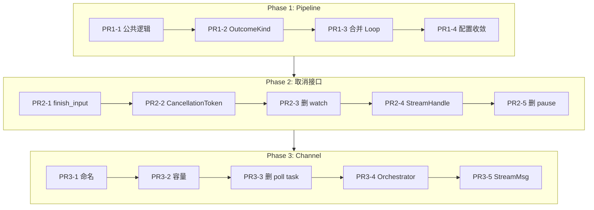

# rcat-voice 架构重构实施计划 v4.0

## 概述

基于 v3.3 稳定版本，进行三个方向的深度重构：

| 方向 | 目标 | PRs |
|------|------|-----|
| **Pipeline 统一** | 合并串行/并行模式为单一调度器 | 4 |
| **取消接口统一** | 双层取消 + StreamHandle 合并 | 5 |
| **Channel 拓扑** | 单 Orchestrator + 命名收敛 | 5 |

---

## 落地约束

### 目标场景

- **单活跃 Turn + Barge-in 抢占**：任意时刻只有一个 active turn，用户开口即触发 epoch++ 切换
- **单输出域**：一个扬声器，不支持混音/并行播放
- **可打断回答**：LLM 回答期间用户说话 → 停止 TTS → 丢弃旧 turn 残留

### 非目标 (Out of Scope)

- **多活跃 Turn 并发**：暂不支持多个 turn 同时合成/播放
- **多人 Turn Arbiter**：多 speaker 仲裁在本重构范围外，可作为后续扩展

> [!IMPORTANT]
> 所有 epoch 丢弃、容量收敛设计均以"单活跃 turn"为前提。如需支持多 turn，需重新评估 Phase 3 设计。

---

## Phase 1: Pipeline 统一调度器

### 设计目标

将 `run()` (串行) 与 `run_parallel()` (并行) 合并为单一调度框架。

### PR1-1: 抽取公共逻辑

#### [MODIFY] [pipeline.rs](file:///e:/rcat/rcat-voice/src/pipeline.rs)

新增 `PipelineState` 结构：

```rust
struct PipelineState {
    current_turn_id: Option<u64>,
    first_audio_emitted: bool,
}

impl PipelineState {
    fn on_segment(&mut self, segment: &Segment, metrics: &dyn MetricsSink) {
        // TtsFirstSegmentSent 上报
        // turn 切换重置
    }

    fn on_metrics(&mut self, segment: &Segment, m: &TtsMetrics, metrics: &dyn MetricsSink) {
        // TtsFirstAudio 上报
    }
}
```

### PR1-2: 引入 OutcomeKind 统一产物

```rust
enum OutcomeKind {
    NeedPlay(SynthesizedAudio),  // 并行：已合成，待播放
    Played(TtsMetrics),          // 串行：已播放
}

struct JobOutcome {
    seq: u64,
    segment: Segment,
    result: Result<OutcomeKind>,
}
```

### PR1-3: 合并调度 Loop

统一结构：
1. 收 segment → 分配 seq → `on_segment_received()`
2. spawn 任务 (SerialRunner / ParallelRunner)
3. `join_next` → 塞入 pending
4. drain pending → `on_metrics()`
5. 退出条件统一

### PR1-4: 配置语义收敛

```rust
pub enum PipelineMode {
    Auto,      // supports_synthesis_queue() ? Decoupled : Serial
    Serial,    // 强制 speak runner
    Decoupled, // 强制 synth+play
}
```

> [!WARNING]
> **TTFA 不回退约束**: `Auto` 模式绝不能把真流式 `speak()` 的引擎误切到 `synthesize→play_samples`。
> 判定逻辑: 仅当 `supports_synthesis_queue()` 返回 `true` 时才走 Decoupled 路径。

---

## Phase 2: 取消/控制接口统一

### 设计目标

- 双层取消：CancellationToken (软退出) + AbortHandle (硬熔断)
- 合并 StreamControl + StreamCancelHandle → StreamHandle
- stop() 默认语义 = interrupt

### 双层取消职责边界

| 层级 | 机制 | 用途 | 阻塞 send 处理 |
|------|------|------|----------------|
| **Soft** | `CancellationToken` | 协作退出、语义统一 | select! 下一个 yield 点生效 |
| **Hard** | `AbortHandle.abort()` + `receiver.close()` | O(1) 熔断、唤醒阻塞 send | 立即唤醒并返回 Err |

> [!IMPORTANT]
> **interrupt 硬 SLA: < 100ms**
> - `stop_fast()` 立即使 epoch++ (CancelScope 失效)
> - `token.cancel()` 广播软退出
> - `abort()` 确保阻塞的 `send().await` 立即失败

### PR2-1: finish_input 解耦

**实现选型**: 采用 `DeltaMsg::{Delta, Eof}` 显式终止信号 (而非 receiver.close())，因为 close 无法从 sender 侧触发。

#### [MODIFY] [streaming.rs](file:///e:/rcat/rcat-voice/src/streaming.rs)

```rust
pub enum DeltaMsg {
    Delta(String),
    Eof,
}

impl StreamControl {
    delta_tx: mpsc::Sender<DeltaMsg>,
    input_finished: AtomicBool,

    pub async fn push_delta(&self, delta: String) -> Result<()> {
        self.delta_tx.send(DeltaMsg::Delta(delta)).await?;
        Ok(())
    }

    pub async fn finish_input(&self) -> Result<()> {
        self.input_finished.store(true, Ordering::Release);
        self.delta_tx.send(DeltaMsg::Eof).await?;
        Ok(())
    }
}
```

### PR2-2: CancellationToken 引入

```rust
// 依赖: tokio-util
use tokio_util::sync::CancellationToken;

// Tokenizer 主循环
loop {
    tokio::select! {
        _ = token.cancelled() => break,
        Some(delta) = delta_rx.recv() => { /* process */ }
    }
}
```

### PR2-3: 删除 watch cancel

移除 `finish_or_cancel` 中的 `watch::Receiver<bool>` 参数，改用 token 驱动。

### PR2-4: StreamHandle 合并

```rust
pub struct StreamHandle {
    // 输入能力
    delta_tx: mpsc::Sender<String>,
    input_finished: Arc<AtomicBool>,

    // 控制能力
    token: CancellationToken,
    tts: Option<Arc<dyn TtsEngine>>,
    tokenizer_abort: AbortHandle,
    pipeline_abort: AbortHandle,

    // 指标
    llm_start: Arc<OnceLock<Instant>>,
}

impl StreamHandle {
    pub async fn push_delta(&self, delta: String) -> Result<()>;
    pub fn finish_input(&self);
    pub fn mark_llm_start(&self);
    pub async fn stop(&self) -> Result<()>;  // 根据 input_finished 选择 drain 或 interrupt
    pub fn interrupt(&self) -> Result<()>;   // 立即停声
}
```

### PR2-5: 删除 pause

从公开 API 移除 `pause()` (已等价于 interrupt)。

---

## Phase 3: Channel 拓扑优化

### 设计目标

- 命名统一消除歧义
- 容量收敛控制内存
- 单 Orchestrator 减少 hop

### PR3-1: 命名收敛

| 旧名 | 新名 |
|------|------|
| `tokenizer::Segment` | `TextSegment` |
| `delta_tx/rx` | `llm_delta_tx/rx` |
| `chunk_tx/rx` | `text_seg_tx/rx` |

**兼容性策略**:
```rust
// tokenizer.rs
pub type Segment = TextSegment;  // deprecated alias
#[deprecated(since = "0.2.0", note = "use TextSegment")]
pub use Segment;
```

**迁移顺序**: 先改内部类型 → 更新 examples → 更新 prelude → 最后删 alias

### PR3-2: 容量收敛

```rust
const DEFAULT_DELTA_CAP: usize = 8192;
const DEFAULT_SEGMENT_CAP: usize = 4096;
```

**环境变量映射** (兼容旧配置):
- `STREAM_DELTA_CAPACITY` → 默认 8192
- `STREAM_SEGMENT_CAPACITY` → 默认 4096

### PR3-3: Relax 决策移到 Pipeline

> [!CAUTION]
> **行为变化风险**: 此 PR 推迟到 PR3-4 Orchestrator 后执行。
> 原因: Pipeline 无法无损合并已切分的短段，而 Orchestrator 持有原始 buffer 可直接读 `buffered_ms()` 做 relax 判断。

**临时处理**: PR3-3 仅删除 `buffer_poll_task` + `watch`，relax 逻辑保留在 Tokenizer；PR3-4 后再迁移到 Orchestrator。

### PR3-4: 单 Orchestrator

合并 Tokenizer + Pipeline 为单一 task：

```rust
struct Orchestrator {
    engine: Arc<dyn TtsEngine>,
    metrics: Arc<dyn MetricsSink>,
    config: OrchestratorConfig,

    // Tokenizer buffer
    buffer: String,
    pending_segments: VecDeque<TextSegment>,

    // Pipeline 调度
    synth_jobs: JoinSet<JobOutcome>,
    pending_outcomes: BTreeMap<u64, JobOutcome>,
    next_seq: u64,
}
```

### PR3-5: 单入口 StreamMsg

```rust
pub enum StreamMsg {
    Delta { text: String, epoch: u64 },
    Eof { epoch: u64 },
}
```

Orchestrator 根据 epoch 过滤过期消息。

---

## Phase 4: 文档同步

每个 Phase 完成后更新：

- `ARCHITECTURE.md`: 新拓扑图、接口定义
- `README.md`: API 变更说明
- 回归测试: TTFA/首音指标、保序、interrupt 行为

---

## 依赖关系



---

## 风险与回归点

| PR | 风险 | 回归测试重点 |
|----|------|-------------|
| PR1-3 | 高 | 串行/并行行为一致性、TTFA |
| PR2-2 | 中 | O(1) 取消保证、barge-in 响应 |
| PR3-4 | 高 | 端到端延迟、首音指标、保序 |

---

## 验证计划

### 自动化测试

```bash
cargo test --features "asr-sherpa turn-smart audio-rodio"
```

### 回归检查清单

| 检查项 | 验证方法 | 通过标准 |
|--------|----------|----------|
| **finish 不挂死** | 调用 `finish_input()` 后等待 session join | 5s 内正常退出 |
| **interrupt 立刻让阻塞 send 失败** | 在 send 阻塞期间调用 `interrupt()` | send 立即返回 Err |
| **过期 turn 数据被丢弃** | 发送带旧 epoch 的 delta | delta 不进入 Tokenizer buffer |
| **队列深度/内存上界** | 长时间运行 + 内存监控 | 队列不超过容量，内存稳定 |
| **TTFA 不回退** | PR1-4 前后对比 `VOICE_TTS_METRICS=1` | Serial 引擎 TTFA ≤ 原值 |
| **保序正确** | 多段文本顺序验证 | 播放顺序 = 输入顺序 |

### 手动验证

1. **TTFA 指标**: `VOICE_TTS_METRICS=1` 运行 voice_assistant
2. **Barge-in**: 验证打断响应 < 100ms
3. **内存**: 长时间运行观察队列大小
